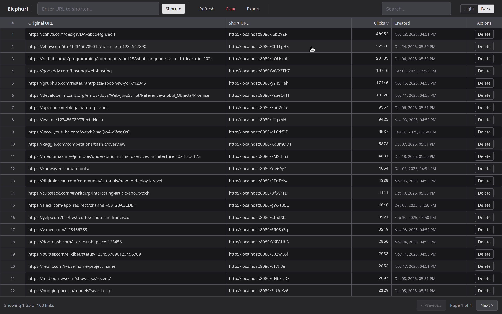

# elephurl backend

URL shortener API built with PHP 8.2, Redis, and MySQL.



## Features

- Shorten URLs with random or custom codes
- Click tracking and basic analytics
- Rate limiting per IP
- Bot detection
- URL safety validation

## Setup

```bash
docker compose up -d
```

Runs on `http://localhost:8080`

## Tests

```bash
docker compose exec php composer test
```

## Linting

```bash
docker compose exec php composer lint
```

## Seed Sample Data

```bash
docker compose exec php composer db:seed
```

Populates the database with 100 sample URLs and click data.
